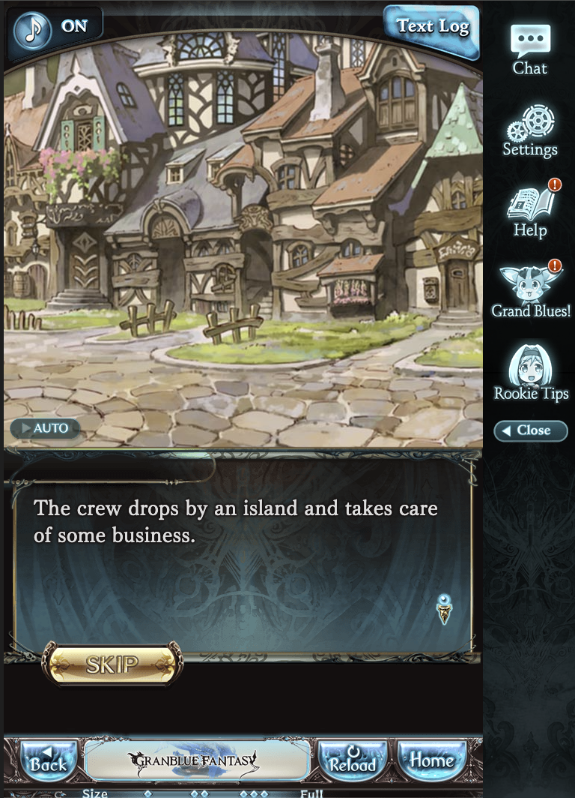
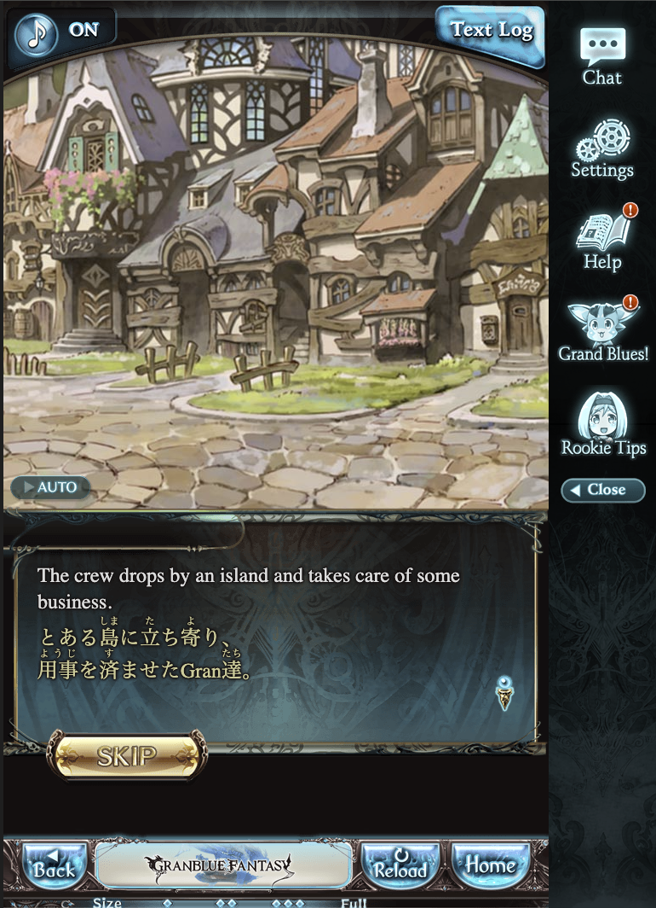
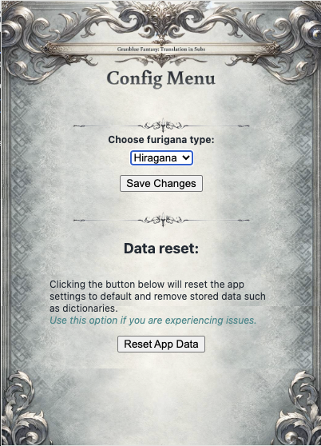

<!--  -->

# Granblue Fantasy: Translation in Subs
by [SubSneaker](https://github.com/SubSneaker) 

A chrome extension to help Language learners learn as they play the game, by injecting both the English and Japanese text into the game's subtitles during cutscenes.

The English text is provided by the game's official translation, and the Japanese text is provided by the game's official subtitles, and both are injected into the text box present in the game's cutscenes.

- [Granblue Fantasy: Translation in Subs](#granblue-fantasy-translation-in-subs)
  - [Usage](#usage)
      - [Pre-extension:](#pre-extension)
      - [Post extension:](#post-extension)
    - [Configuration](#configuration)
  - [For Developers](#for-developers)
    - [Installation](#installation)
    - [Running](#running)
    - [Building](#building)
  - [Currently known issues:](#currently-known-issues)
  - [Specific issues handled:](#specific-issues-handled)
    - [TODO:](#todo)

## Usage
To activate, simply install the extension and navigate to an event cutscene in the game. The extension will automatically detect the cutscene and inject the translations into the text box.

If the extension is not working, try refreshing the page, in some cases the game doesn't actually navigate the URL, this is gonna be fixed in the future.

If the extension is properly running, your event page should present like this:
#### Pre-extension:

#### Post extension:

### Configuration
The extension has a configuration menu accessible by pressing on the icon in the top right of the browser, and then clicking on the extension's icon. This will open a popup with the configuration options.

From there feel free to select as you desire:

**NOTE: This extension currently ONLY works on Chrome (other chromiums not yet verified) on PC. Mobile browser support is planned later on.**

***I hope this helps you learn Japanese, and enjoy the game!*** 

## For Developers
### Installation
To install the extension, simply clone the repository and run `npm install` to install the dependencies.

### Running
To run the extension, you can run `npm run start` to start the development server, and then load the extension into your browser by navigating to `chrome://extensions/` and clicking `Load unpacked` and selecting the `dist` folder.

### Building
To build the extension, you can run `npm run build` to build the extension into the `dist` folder.
The extension will be built in mode `production` and will be ready to be loaded into your browser.
*Note that logging is mostly disabled in production mode.*

## Currently known issues:
- Due to a timing issue, the extension sometimes doesn't load the translations into the game's text box. This is due to the extension trying to find game-context flags after the game fully loaded to avoid undefined issues. If this happens going to the next textbox will usually resolve the matter.
- On some occasions the extension stops working and doesn't load the translated subs into the game's text box. Causes are still unknown, need to be worked on. Currently the only solution is to refresh the page. In the future i'll add a logdump feature to help debug this issue.

## Specific issues handled:

- Due to using a library called [kuroshiro](https://github.com/hexenq/kuroshiro) for the transliteration of Kanji to furigana, there was an adjustment that had to be made due to the library probably not being made to handle the way extensions access file URIs, and it mistakenly assumes to try and reach for the `node_modules` which doesn't exist within the serverless context of the extension, instead accidentally trying to access GBF's servers.  
I had to make a hard adjustment for this specific case so I used `patch-package` library to make a patch for the `kuroshiro` library to fix this issue.

### TODO:
- [x] Fix the routing issue (eg. When a page enters a scene without being refreshed or a new address (Dynamic URL change), it won't retrigger the code to run again).
- [ ] Refactor the code into modules
- [x] Create an extension page with GUI and a background worker to maintain flags.
- [ ] Look into possibly AI translation additions
- [ ] If AI is added, consider more languages (low priority)
- [ ] Mobile browser support.
- [x] Move the dictionaries to a web Storage to avoid requesting it every time and slowing the page.
- [x] Find a way to access page context such as `Game` variable to get version for request
- [ ] Code occasionally stops working before starting any requests, need to find out why
- [x] Try adding options for romaji (low priority)